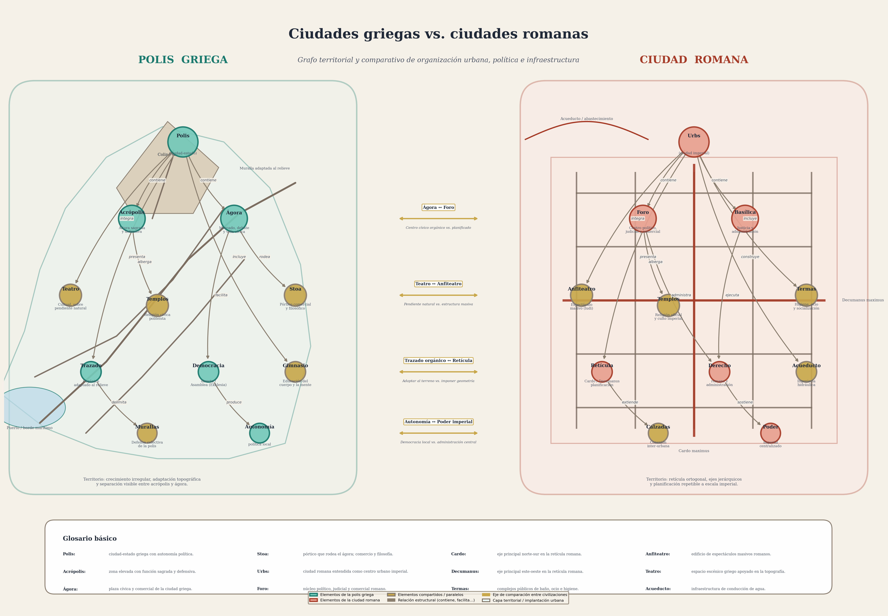

# Diferencias entre la ciudad griega y la ciudad romana

> **Recurso visual:** grafo comparativo generado con `matplotlib` + `networkx` (300 dpi).

---

## 1. Introducción

La ciudad antigua no es un fenómeno homogéneo. Aunque Grecia y Roma comparten raíces mediterráneas, sus modelos urbanos responden a **lógicas políticas, sociales y técnicas distintas**. En este documento se identifican las diferencias estructurales entre la *polis* griega y la *urbs* romana, organizadas en ejes temáticos que el recurso adjunto representa visualmente mediante una **doble lectura**: por un lado, las relaciones institucionales; por otro, la **implantación territorial** de cada forma urbana.

---

## 2. Cuadro comparativo sintético

| Dimensión | Polis griega | Ciudad romana |
|---|---|---|
| **Forma urbana** | Trazado orgánico, adaptado al relieve y la topografía local | Retícula ortogonal (*cardo* / *decumanus*), replicable en cualquier terreno |
| **Centro cívico** | **Ágora** — espacio abierto de mercado, debate y encuentro ciudadano | **Foro** — centro político, judicial, comercial y ceremonial |
| **Espacio sagrado** | **Acrópolis** — punto elevado con templos, separado del centro cívico | Templos integrados en el foro; culto imperial como función del Estado |
| **Forma de gobierno** | Democracia directa (*ekklesia*), oligarquía o tiranía según la polis | Derecho romano codificado; administración provincial centralizada |
| **Infraestructura** | Obras a escala de la polis: murallas, fuentes, puerto | Ingeniería monumental: **acueductos, calzadas, termas, cloacas** |
| **Espectáculo** | **Teatro** construido sobre pendiente natural (culto a Dioniso) | **Anfiteatro** como estructura autónoma masiva (*ludi*, gladiadores) |
| **Socialización** | Gimnasio, stoa, simposio | Termas, foro, *tabernae* |
| **Escala territorial** | Ciudad-estado autónoma con territorio rural limitado (*chora*) | Red imperial de ciudades conectadas por calzadas |
| **Principio organizador** | Identidad cívica local y participación directa | Poder imperial, estandarización y control territorial |

---

## 3. Análisis por ejes

### 3.1 Forma urbana y trazado

La polis griega crece **con** el terreno: calles estrechas que siguen curvas de nivel, plazas irregulares, y un aprovechamiento de la pendiente para el teatro y las defensas. Solo a partir de Hipódamo de Mileto (s. V a.C.) aparece la cuadrícula, pero incluso entonces, la retícula griega se adapta al sitio.

La ciudad romana, en cambio, **impone** su geometría. El trazado estándar del *castrum* militar —*cardo maximus* (norte-sur) y *decumanus maximus* (este-oeste)— se replica desde Britania hasta Siria. La regularidad no es solo estética: es una herramienta de **control territorial y logístico**.

### 3.2 Ágora frente a Foro

El **ágora** es un espacio abierto y flexible: mercado por la mañana, asamblea ciudadana por la tarde, paseo filosófico al atardecer. No está monumentalizado de forma rígida; su perímetro lo definen las *stoas* (pórticos).

El **foro** romano es un recinto más formal: basílica para la justicia, *curia* para el senado local, templos de culto imperial, arcos de triunfo. Es un **escenario de poder** tanto como un espacio público.

### 3.3 Política y gobierno

La polis griega experimenta con distintos regímenes, pero su forma más célebre es la **democracia directa** ateniense: los ciudadanos votan en asamblea (*ekklesia*), sin representantes intermedios. El espacio urbano refleja esta horizontalidad.

Roma evoluciona de la república al imperio, y su urbanismo acompaña ese proceso: el foro pasa de ser el centro de la *res publica* a un **monumento a la autoridad imperial**. El derecho romano codificado y la burocracia provincial son el motor que mantiene la red de ciudades funcionando.

### 3.4 Infraestructura e ingeniería

La diferencia es cuantitativa y cualitativa:

- **Griega:** murallas ciclópeas, fuentes públicas, puertos, algún acueducto (Samos). Escala modesta pero funcional.
- **Romana:** acueductos de decenas de kilómetros (Pont du Gard), calzadas pavimentadas de más de 80 000 km, cloacas (*Cloaca Maxima*), termas con calefacción por hipocausto. La ingeniería romana es un **instrumento de Estado**.

### 3.5 Espectáculo y sociabilidad

| Aspecto | Griega | Romana |
|---|---|---|
| Tipo de espacio | Teatro semicircular excavado en ladera | Anfiteatro elíptico autoportante |
| Función principal | Tragedia, comedia, culto a Dioniso | Gladiatura, *venationes*, naumaquias |
| Capacidad | ~15 000 (Epidauro) | ~50 000 (Coliseo) |
| Significado cívico | Formación moral del ciudadano | Control social (*panem et circenses*) |

Las **termas** romanas no tienen equivalente griego directo: combinan baño, gimnasio, biblioteca y jardín en un solo complejo público financiado por el Estado o por *evergetas*.

---

## 4. Cómo leer el grafo territorial

El gráfico generado por `generar_grafo.py` se organiza así:

- **Panel izquierdo (verde):** la polis griega aparece sobre una silueta territorial irregular con costa, puerto, colina sacra, muralla adaptada al relieve y recorridos no ortogonales. Encima de esa base se sitúan los nodos institucionales: *acrópolis*, *ágora*, *teatro*, *gimnasio* y autonomía política.
- **Panel derecho (rojo):** la ciudad romana aparece sobre una base ortogonal con retícula, *cardo maximus*, *decumanus maximus* y traza de acueducto. Sobre esa base se distribuyen los nodos del *foro*, basílica, anfiteatro, termas, derecho y poder imperial.
- **Zona central (dorado):** ejes de comparación directa que conectan conceptos paralelos con flechas bidireccionales.
- **Aristas etiquetadas:** verbos que describen la relación estructural (*contiene, facilita, ejecuta, extiende…*).
- **Capa territorial:** permite ver no solo qué instituciones existen, sino **cómo se insertan en el espacio urbano**: separación entre altura sagrada y zona cívica en Grecia, frente a jerarquía axial y parcelación regular en Roma.
- **Colores de nodo:**
  - Verde claro → exclusivo de la polis griega.
  - Rojo claro → exclusivo de la ciudad romana.
  - Dorado → elementos compartidos o paralelos entre ambas civilizaciones.

## 5. Glosario básico

| Término | Significado |
|---|---|
| **Polis** | Ciudad-estado griega, entendida como comunidad política autónoma y no solo como asentamiento físico. |
| **Acrópolis** | Zona alta y fortificada de la ciudad griega, con templos y funciones sagradas y defensivas. |
| **Ágora** | Plaza principal de la polis; espacio de mercado, encuentro y discusión cívica. |
| **Stoa** | Pórtico cubierto que delimita el ágora y sirve para comercio, circulación y actividad intelectual. |
| **Urbs** | La ciudad romana como forma urbana organizada dentro de una lógica jurídica, administrativa e imperial. |
| **Foro** | Centro político, judicial, comercial y ceremonial de la ciudad romana. |
| **Cardo maximus** | Eje principal norte-sur del trazado romano. |
| **Decumanus maximus** | Eje principal este-oeste del trazado romano. |
| **Termas** | Complejos públicos de baño, ocio, ejercicio y sociabilidad en la ciudad romana. |
| **Anfiteatro** | Edificio elíptico romano dedicado a espectáculos de masas. |
| **Teatro** | Espacio escénico griego vinculado al culto y a la formación cívica, normalmente adaptado a una ladera. |
| **Acueducto** | Infraestructura de captación y conducción de agua hacia la ciudad. |

---

## 6. Conclusión

La **polis griega** es una ciudad que se entiende desde la **participación política directa** y la **adaptación al paisaje**: su forma urbana expresa la identidad de una comunidad autónoma.

La **ciudad romana** es una ciudad que se entiende desde el **control territorial**, la **estandarización técnica** y la **representación del poder imperial**: su forma urbana es un instrumento de gobierno.

Ambas son ciudades políticas, pero la primera pregunta por *quién participa* y la segunda por *quién gobierna*.

---

## 7. Referencias conceptuales

- Mumford, L. (1961). *The City in History*.
- Morris, A. E. J. (1994). *History of Urban Form*.
- Castagnoli, F. (1971). *Orthogonal Town Planning in Antiquity*.
- Hansen, M. H. (2006). *Polis: An Introduction to the Ancient Greek City-State*.
- Zanker, P. (2000). *The Power of Images in the Age of Augustus*.

---

*Generado con `generar_grafo.py` — matplotlib + networkx — 300 dpi.*
